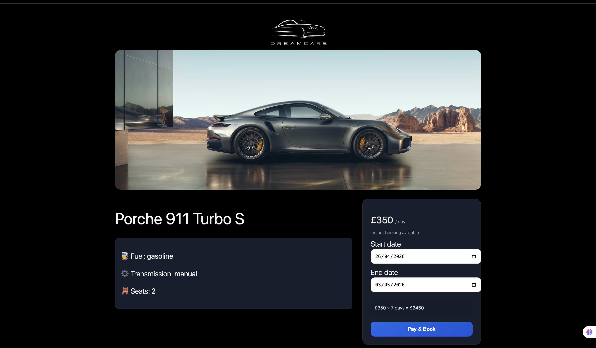

# 🚗 DreamCars


A modern car rental web app built with WordPress + Stripe integration, featuring real-time booking and payment flow.

---

## 🌐 Live Demo

⚠️ Live demo is temporarily unavailable (uses ephemeral tunnel)

👉 Run locally using setup instructions below

⚠️ This is a **test environment** (Stripe test mode enabled)  
Use Stripe test card: `4242 4242 4242 4242`

---

## 📸 Screenshots

### 🏠 Home Page
<p align="center">
  
</p>

<<<<<<< HEAD
### 🚗 Car Details | 📅 Booking System
=======
### 🚗 Car Details  &  📅 Booking System
>>>>>>> 0eecae8 (Move and update README)
<p align="center">
  
</p>

###  💳 Stripe checkout integration
<p align="center">
  
</p>

---

## 🎯 Project Purpose

DreamCars is a car rental booking platform built to simulate a real-world rental system with payment processing, availability control, and admin management.

## ✨ Features

- 🚗 Browse available cars
- 📅 Date-based booking system
- 💳 Stripe checkout integration
- ⚡ Real-time price calculation
- 🔒 Booking conflict prevention (no double booking)
- 🌙 Responsive design (mobile + desktop)

---

## 🛠 Tech Stack

**Backend**
- WordPress (PHP)
- MySQL

**Frontend**
- JavaScript
- HTML / CSS

**Payments**
- Stripe Checkout API (test mode)

**Infrastructure**
- Local WordPress environment
- Cloudflare Tunnel (dev demo)

---

## ⚙️ Local Setup

1. Clone repository
```bash
git clone https://github.com/Arturgouveia1970/Dreamcars.git

2. Place theme inside:

```
wp-content/themes/

```

3. Install dependencies:

```bash
composer install
```

4. Configure Stripe key in `wp-config.php`:

```php
define('STRIPE_SECRET_KEY', 'your_stripe_key_here');
```

5. Start your local WordPress environment

---

## 💳 Stripe Setup

* Use test keys from https://dashboard.stripe.com/test/apikeys
* Payments are handled via Stripe Checkout
* Booking is created after successful payment

---

## 🔐 Security Notes

* Stripe secret key is stored in `wp-config.php`
* Sensitive files are excluded via `.gitignore`
* No secrets are committed to the repository

---

## 🚀 Future Improvements

* Stripe webhooks (production-grade confirmation)
* Booking calendar with disabled dates
* User accounts & booking history
* Admin dashboard enhancements

---

## 👨‍💻 Author

Built by Artur Gouveia

---

## 📄 License

MIT License
